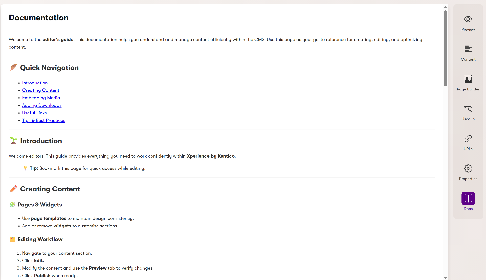

# Xperience Community: Admin Extensions

[](https://www.nuget.org/packages/XperienceCommunity.AdminExtensions)

## Description

This package provides useful extensions to the Kentico Xperience administration interface. The extensions are automatically registered once the package is installed, enhancing the admin experience with additional functionality and improved workflows.

## Library Version Matrix

| Xperience Version | Library Version |
|-------------------|-----------------|
| >= 30.6.0         | >= 1.0.0        |

> **Note:** The latest version that has been tested is 30.6.0

## ⚙️ Package Installation

Add the package to your application using the .NET CLI

```bash
dotnet add package XperienceCommunity.AdminExtensions
```

## 🚀 Quick Start

No additional configuration is required! Once the package is installed, the admin extensions will be automatically registered and available in your Kentico Xperience administration interface.

## ⚙️ Configuration

The package supports optional configuration to customize certain features. Add the following section to your `appsettings.json`:

```json
{
  "XperienceCommunityAdminExtensions": {
    "ContentHubListPageSize": 100
  }
}
```

### Configuration Options

| Setting | Description | Default Value |
|---------|-------------|---------------|
| `ContentHubListPageSize` | Sets the number of items displayed per page in the Content Hub list | `50` |

## ✨ Features

### Event Log Enhancements

**Clear Event Log Button**: Adds a convenient "Clear" button to the Event Log page header, allowing administrators to quickly clear all event log entries with a single click.

### Content Hub Enhancements

**Custom Page Size**: Allows configuration of the number of items displayed per page in the Content Hub list. This helps administrators manage large content repositories more efficiently by customizing the page size to their preference.

### Content Type List Enhancements

**Content Type Filtering**: Adds advanced filtering capabilities to the Content Type list page, allowing administrators to filter content types by their usage:
- **Website** - Content types used for website pages
- **Reusable** - Content types used for reusable content items
- **Email** - Content types used for email campaigns
- **Headless** - Content types used for headless/API content delivery

The filter supports multi-selection, enabling administrators to view content types across multiple usage categories simultaneously.

### Documentation Tab

**Content Type Documentation**: Adds a "Documentation" tab to content items in the admin interface, displaying content type-specific documentation written in Markdown format. This feature helps content editors understand how to use each content type effectively.



#### Key Features
- **Markdown Support**: Write documentation in Markdown format with full syntax support
- **Automatic Parsing**: Markdown is automatically converted to beautifully styled HTML
- **Content Type Specific**: Each content type can have its own documentation
- **Localization Integration**: Uses the [XperienceCommunity.Localization](https://github.com/xperience-community/xperience-community-localization) package for managing documentation
- **Clean UI**: Integrated seamlessly into the Xperience admin interface

#### Setup Instructions

This feature depends on the `XperienceCommunity.Localization` package (already included as a dependency). To add documentation for your content types:

1. **Add Localization Keys**: Add localization keys following the pattern:
   ```
   XperienceCommunity.AdminExtensions.DocumentationTab.[CONTENT_TYPE_NAME]
   ```

2. **Example Keys**:
   - `XperienceCommunity.AdminExtensions.DocumentationTab.Generic.Home`
   - `XperienceCommunity.AdminExtensions.DocumentationTab.Article`
   - `XperienceCommunity.AdminExtensions.DocumentationTab.BlogPost`
   - `XperienceCommunity.AdminExtensions.DocumentationTab.Product`

3. **Add Markdown Content**: The documentation content should be added in Markdown format. Once the localization key is added, the extension will automatically find it and render it in the Documentation tab.

#### Example Markdown Documentation

```markdown
# Home Page Documentation

## Overview
This content type is used for the website home page.

## Fields

### Page Title
- **Type**: Text
- **Required**: Yes
- **Description**: The main title displayed on the home page
- **Guidelines**: Keep it concise and engaging (recommended: 50-60 characters)

### Hero Image
- **Type**: Asset
- **Required**: Yes
- **Description**: The main hero image displayed at the top of the page
- **Guidelines**: Use high-quality images with 1920x1080 resolution

## Best Practices
1. Keep the page title SEO-friendly
2. Use descriptive alt text for all images
3. Optimize images for web performance
```

## 🤝 Contributing

Contributions are welcome! Please feel free to submit a Pull Request.

## 📄 License

This project is licensed under the MIT License.